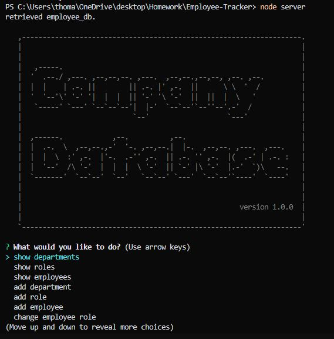

# Employee-Tracker
12 SQL: Employee Tracker

## Description

This is an employee tracker that can view, or add, departments, roles, and employees and insert them into mysql tables.

## Table of Contents

- [Installation](#installation)
- [Usage](#usage)
- [Credits](#credits)
- [License](#license)

## Installation

- inquirer
- mysql2
- console.table

## Usage

Command line will promp user for questions for data to be viewed or edited.

video:

Screenshot: https://drive.google.com/file/d/1I6viz3HuYjPN9grB3oKr7MG9kpMPbr0B/view

## Credits

-100mph class no breaks

## License

N/A